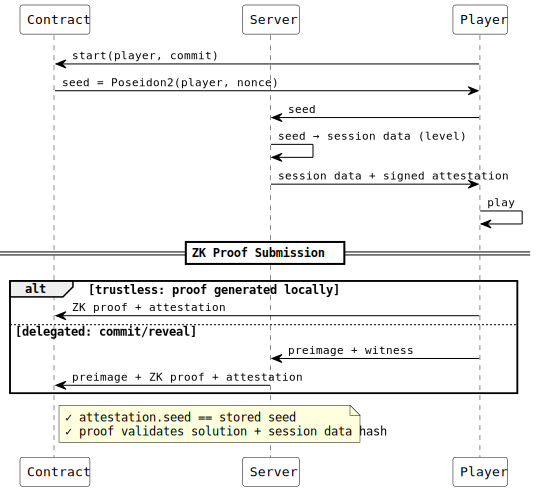

# chain-slicer

## Soroban Contract for Stellar Game Studio

This contract implements the 2-player variant of **Chain Slicer** from [xray.games](https://xray.games), built for the Stellar Game Studio flow.

Players take turns solving geometry-based puzzles and submit their proofs to the smart contract. The contract uses X-ray's Stellar zero-knowledge primitives to verify each solution — scores are proven with ZK circuits and settled onchain. Levels are seeded deterministically using Poseidon2 hashing.

For full documentation, zero-knowledge circuits, and contracts:

👉 **[FredericRezeau/xray-games](https://github.com/FredericRezeau/xray-games)**